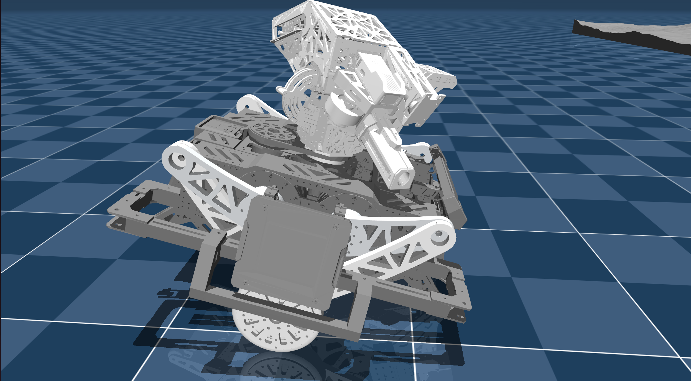
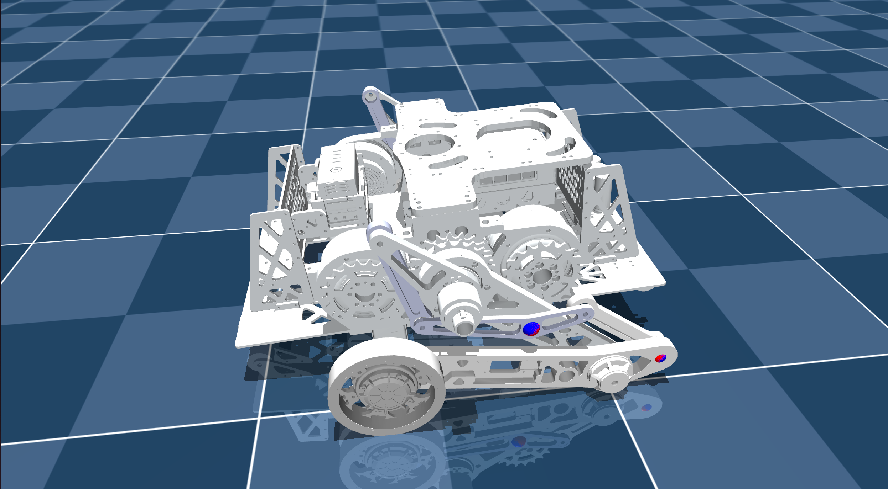

# RMInfantry 轮腿机器人控制系统

<table>
  <tr>
    <td align="center"><br/><sub>cyclBot 仿真模型</sub></td>
    <td align="center"><br/><sub>seriBot 仿真模型</sub></td>
  </tr>
</table>

## 项目概述

本项目是一个完整的轮腿机器人（Wheel-Legged Robot）控制和仿真系统，基于ROS2框架开发。项目包含两款机器人平台：**cyclBot**和 **seriBot** ，支持实时硬件控制、MuJoCo仿真、动力学建模和高级控制算法。

## 主要特性

* ✅  **双机器人平台支持** ：cyclBot和seriBot两种配置
* ✅  **完整的控制栈** ：底层硬件控制、中层运动控制、高层决策框架
* ✅  **高精度仿真** ：MuJoCo物理引擎仿真
* ✅  **先进控制算法** ：LQR、PID、状态估计器、卡尔曼滤波
* ✅  **模块化架构** ：清晰的包结构，易于扩展和维护
* ✅  **实时性能** ：支持硬件实时控制

## 工程结构

```
RMInfantry_wheelLegged_ws/src/
├── wheel_legged_control          # 高层控制逻辑
├── wheel_legged_description      # 机器人URDF/MJCF模型定义
├── wheel_legged_hw              # 硬件驱动层
├── wheel_legged_interfaces      # 控制接口定义
├── wheel_legged_launch          # 启动脚本和配置文件
├── wheel_legged_matlab          # MATLAB建模和LQR计算
├── wheel_legged_msgs            # ROS2消息定义
└── wheel_legged_sim             # MuJoCo仿真环境
```

### 核心包详解

#### 1. **wheel_legged_control** - 高层控制模块

主要负责机器人的运动控制和决策逻辑。

**子模块：**

* **Controller/** ：各类控制器
* `LegController.hpp`：腿部运动控制器
* `LQRController.hpp`：线性二次调节器
* `PIDController.hpp`：PID反馈控制
* `RotateController.hpp`：旋转控制
* `StateEstimator.hpp`：状态估计器
* **Filter/** ：滤波算法
* `kalman_filter.cpp/hpp`：卡尔曼滤波器实现
* **Model/** ：机器人动力学模型
* `WheelLeggedRobot.cpp/hpp`：轮腿机器人动力学模型
* **config_manager/** ：配置管理
* 基础配置管理器
* 底盘配置管理器
* **fsm/** ：有限状态机
* `joint_fsm.hpp`：关节控制状态机
* **src/** ：主程序
* `chassis_control.cpp`：底盘控制节点
* `gimbal_control.cpp`：云台控制节点
* `shoot_control.cpp`：射击控制节点
* `user_control.cpp`：用户输入处理节点

#### 2. **wheel_legged_description** - 机器人模型定义

包含两个机器人平台的完整模型定义。

**cyclBot 平台：**

```
cyclBot/
├── urdf/
│   └── wheelLegged_cyclBot.urdf       # URDF模型定义
├── mjcf/
│   ├── wheelLegged_cyclBot.xml        # MuJoCo模型定义
│   ├── scene.xml                      # 标准仿真场景
│   └── scene_terrain.xml              # 复杂地形场景
├── meshes/                            # 47个STL/OBJ网格文件
└── terrain/                           # 地形文件
├── height_field.png               # 高度图
└── uneven.png                     # 不规则地形
```

**seriBot 平台：**

```
seriBot/
├── urdf/
│   └── wheelLegged_seriBot.urdf
├── mjcf/
│   ├── wheelLegged_seriBot.xml
│   ├── scene.xml
│   └── scene_terrain.xml
├── meshes/                            # 30个STL网格文件
└── terrain/
├── height_field.png
└── uneven.png
```

#### 3. **wheel_legged_hw** - 硬件驱动层

实现与实际硬件的通信和控制。

**设备驱动：**

* `dji_motor.hpp`：DJI电机驱动
* `dm_motor.hpp`：达摩院（DM）电机驱动
* `hipnuc_imu.hpp`：HipNuc IMU传感器驱动
* `dji_bsp.hpp`：DJI底层支持包

**通信接口：**

* `usb2fdcan/`：USB转FD-CAN通信库
* `hipnuc_imu/`：IMU解析库（NMEA解码）

**控制流程：**

```
User Command
↓
Control Algorithm (wheel_legged_control)
↓
Hardware Bridge (hardware_bridge_node.cpp)
↓
Device Driver (DJI Motor / DM Motor)
↓
CAN/USB Communication
↓
Physical Robot
```

#### 4. **wheel_legged_interfaces** - 接口层

定义ROS2消息和接口标准。

**接口定义：**

* `chassis_ctrl_interface.hpp`：底盘控制接口
* `chassis_state_interface.hpp`：底盘状态接口
* `joint_cmd_interface.hpp`：关节命令接口
* `joint_state_interface.hpp`：关节状态接口
* `imu_state_interface.hpp`：IMU状态接口

#### 5. **wheel_legged_msgs** - 消息定义

完整的ROS2消息类型定义，分为两层：

**高层控制消息（HighLevelControl/）：**

* `ChassisCtrl.msg`：底盘控制命令
* `ChassisState.msg`：底盘状态反馈
* `GimbalCtrl.msg`：云台控制命令
* `ShootCtrl.msg`：射击控制命令
* `UserCmd.msg`：用户输入命令

**通用消息（Common/）：**

* 控制器追踪信息：`LegControllerTrace`, `LqrControllerTrace`, `PidControllerTrace`
* 模型信息：`BodyWorldFrame`, `LegVmcJointFrame`, `WheelLeggedRobotState`
* 观测器信息：`KalmanFilterTrace`, `FnEstimatorTrace`

**低层控制消息（LowLevelControl/）：**

* `JointCmd.msg` / `JointCmds.msg`：关节命令
* `JointState.msg` / `JointStates.msg`：关节状态
* `IMUState.msg`：IMU测量数据

#### 6. **wheel_legged_sim** - MuJoCo仿真环境

提供物理仿真和机器人行为验证。

**核心组件：**

* `mujoco_sim.cpp`：MuJoCo仿真主程序
* `simulation_brige_node.cpp`：仿真与ROS2的桥接
* `simulation_interfaces.hpp`：仿真接口定义

**工具和支持：**

* `lodepng/`：PNG图像处理库（用于地形生成）
* `sw2urdf/`：URDF转换工具
* `terrain_tool/`：地形生成工具
* `terrain_generator.py`：Python地形生成脚本
* `scene.xml`：MuJoCo场景配置

#### 7. **wheel_legged_launch** - 启动和配置

提供统一的启动脚本和参数配置。

**启动脚本：**

* `bringup.launch.py`：完整系统启动
* `hardware.launch.py`：硬件控制启动
* `simulation.launch.py`：仿真环境启动
* `chassis_control.launch.py`：底盘控制启动
* `gimbal_control.launch.py`：云台控制启动
* `shoot_control.launch.py`：射击控制启动
* `user_control.launch.py`：用户交互启动
* `display.launch.py`：可视化显示启动

**配置文件：**

```
config/
├── cyclBot/
│   ├── chassis_control_config.yaml         # 底盘控制参数
│   ├── gimbal_control_config.yaml          # 云台控制参数
│   ├── shoot_control_config.yaml           # 射击控制参数
│   └── model/
│       └── physical_params.yaml            # 物理参数
└── seriBot/
├── chassis_control_config.yaml
├── gimbal_control_config.yaml
├── shoot_control_config.yaml
└── model/
└── physical_params.yaml
```

**可视化工具：**

* `rviz/display.rviz`：RViz配置文件
* `plotjuggler/plotjuggler.xml`：PlotJuggler数据可视化配置

#### 8. **wheel_legged_matlab** - 建模和仿真

离线建模、动力学分析和LQR控制器设计。

**cyclBot和seriBot均包含：**

* `linearize_system.m`：系统线性化脚本
* `compute_lqr.m`：LQR控制器设计
* `simplify_dynamics.m`：动力学简化脚本
* `kinematic_analysis.py`：运动学分析（seriBot）
* `推导-v2.md`：理论推导文档（中文）
* `.mat`数据文件：动力学、线性化系统、LQR结果

## 快速开始

### 系统要求

* **操作系统** ：Ubuntu 20.04 或 22.04
* **ROS版本** ：ROS 2 (Foxy 或更新版本)
* **构建工具** ：CMake 3.10+、GCC 9.0+
* **仿真环境** ：MuJoCo 3.4.0
* **依赖库** ：Eigen3、yaml-cpp

### 安装步骤

```bash
# 1. 克隆仓库
git clone <repository_url> ~/RMInfantry_wheelLegged_ws
cd ~/RMInfantry_wheelLegged_ws

# 2. 安装依赖
rosdep install --from-paths src --ignore-src -r -y

# 3. 构建工程
colcon build

# 4. 配置环境
source install/setup.bash
```

### 仿真运行

```bash
# 启动完整仿真系统
ros2 launch wheel_legged_launch simulation.launch.py robot_type:=cyclBot

# 或选择seriBot
ros2 launch wheel_legged_launch simulation.launch.py robot_type:=seriBot
```

### 硬件运行

```bash
# 启动硬件控制系统
ros2 launch wheel_legged_launch bringup.launch.py robot_type:=cyclBot
```

### 可视化

```bash
# 启动RViz可视化
ros2 launch wheel_legged_launch display.launch.py robot_type:=cyclBot

# 启动PlotJuggler数据分析
ros2 run plotjuggler plotjuggler
```

## 控制架构

### 分层控制框架

```
┌─────────────────────────────────┐
│   User Control Layer            │  user_control.cpp
│   (Keyboard/Joystick Input)     │
└──────────────┬──────────────────┘
    │
┌──────────────▼──────────────────┐
│  High-Level Control Layer       │  chassis_control.cpp
│  • Motion Planning              │  gimbal_control.cpp
│  • State Estimation             │  shoot_control.cpp
│  • LQR / PID Control            │
└──────────────┬──────────────────┘
    │
┌──────────────▼──────────────────┐
│  Control Interface Layer        │  Control/
│  • Leg Controller               │  Filter/
│  • Rotate Controller            │  Model/
│  • Kalman Filter                │
└──────────────┬──────────────────┘
    │
┌──────────────▼──────────────────┐
│  Hardware Bridge                │  hardware_bridge_node.cpp
│  • Device Command Translation   │
│  • State Feedback Collection    │
└──────────────┬──────────────────┘
    │
┌──────────────▼──────────────────┐
│  Device Driver Layer            │  devices/
│  • DJI Motor Driver             │
│  • DM Motor Driver              │
│  • IMU Driver                   │
│  • CAN Communication            │
└──────────────┬──────────────────┘
    │
Physical Robot / Simulator
```

## 关键控制算法

### 1. 状态估计

* **卡尔曼滤波器** ：融合IMU、电机反馈、轮速计数据
* 估计机器人全局位置、速度、姿态

### 2. 运动控制

* **LQR（线性二次调节）** ：最优化追踪轨迹
* **PID控制** ：稳定反馈控制
* **腿部控制器** ：跳跃/爬行模式转换

### 3. 状态机

* **Joint FSM** ：管理关节的不同工作模式
* 平滑的模式切换和安全保护

## 消息流向

```
User Input
↓
[user_control] → UserCmd.msg
↓
[chassis_control] → ChassisCtrl.msg
↓
[State Estimator] → ChassisState.msg (feedback)
↓
[LQR/PID Controller] → JointCmd.msg
↓
[Hardware Bridge] → CAN/USB Command
↓
[Motor Driver] → Actual Motor Control
↓
Motor Feedback → [IMU/Sensor] → JointState.msg
```

## 配置管理

所有参数配置都在 `wheel_legged_launch/config/` 目录中：

### 底盘控制参数 (chassis_control_config.yaml)

* 最大速度、加速度限制
* PID/LQR参数
* 控制循环频率

### 模型物理参数 (physical_params.yaml)

* 机器人质量、重心位置
* 轮子半径、轮距
* 电机齿轮比、最大扭矩

### 云台和射击参数

* 云台速度、加速度
* 射击速率、弹道补偿

## 扩展和自定义

### 添加新的控制算法

1. 在 `wheel_legged_control/common/Controller/` 中创建新的控制器类
2. 在 `wheel_legged_control/src/` 中创建对应的ROS节点
3. 更新启动脚本和消息定义

### 支持新的硬件设备

1. 在 `wheel_legged_hw/devices/` 中实现新的驱动类
2. 在硬件桥接节点中注册驱动
3. 定义相应的硬件接口

### 修改机器人模型

1. 编辑URDF文件（kinematic chain）
2. 编辑MJCF文件（物理仿真参数）
3. 更新网格文件（若改变外形）
4. 在MATLAB中重新计算线性化和LQR

## 开发工具和调试

### RViz 可视化

* 实时显示机器人状态
* 显示传感器数据（IMU、点云等）
* 支持交互式命令发送

### PlotJuggler 数据分析

* 实时绘制控制变量
* 对比多次运行结果
* 导出数据用于离线分析

### MATLAB/Simulink

* 系统建模和仿真
* 控制器设计和优化
* 理论验证

### MuJoCo Python 脚本

* 快速仿真验证
* 批量参数扫描
* 地形生成工具

## 文件列表

**关键文件统计：**

* 总计 199 个文件，64 个目录
* C++源文件：主要控制和硬件驱动逻辑
* URDF/MJCF：机器人模型定义
* Python脚本：工具和地形生成
* YAML配置：参数管理
* MATLAB脚本：离线设计和分析

## 常见问题

**Q: 如何在实机和仿真之间切换？**
A: 使用不同的启动命令。仿真使用 `simulation.launch.py`，硬件使用 `bringup.launch.py`。

**Q: 如何调整控制参数？**
A: 编辑 `wheel_legged_launch/config/` 下的YAML文件，然后重新启动节点。

**Q: 支持哪些输入设备？**
A: 目前支持键盘和游戏手柄，可在 `user_control.cpp` 中扩展。

**Q: 如何添加新的传感器？**
A: 在 `wheel_legged_hw/devices/` 中实现驱动，在消息定义中添加数据类型，更新状态估计器。

## 贡献指南

欢迎提交Issue和Pull Request来改进本项目。请确保：

1. 代码符合项目风格规范
2. 添加相应的测试
3. 更新相关文档

## 许可证

本项目遵循 [LICENSE] 许可证。

## 联系方式

对于技术问题或合作需求，请联系项目维护者。
